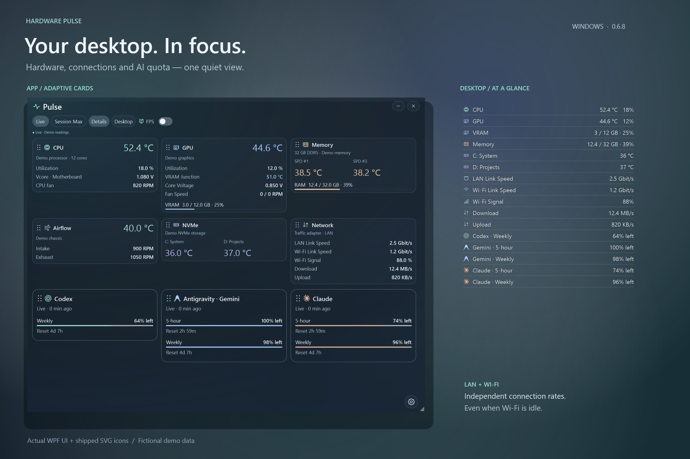

# Hardware Pulse



*Actual WPF UI and shipped SVG icons, rendered with fictional demo data on a composed background. / 真实 WPF UI 与实际 SVG icons，使用 demo 数据及合成背景。[Render source](scripts/Render-Hero.ps1).*

[Changelog / 更新记录](CHANGELOG.md)

[MIT License](LICENSE) · [Privacy policy](PRIVACY.md) · [Code signing policy](SIGNING.md)

[Dependency maintenance and Linux/macOS roadmap](docs/DEPENDENCIES.md)

**[Download 0.6.8 / 下载 0.6.8 EXE](https://github.com/medking82/hardware-pulse/releases/download/v0.6.8/HardwarePulse-Setup.exe)** · [0.6.8 release notes](https://github.com/medking82/hardware-pulse/releases/tag/v0.6.8)

**0.5.0** migrates the installed UI, collector and startup helpers to C#/.NET without a PowerShell runtime dependency. [Measured comparison](docs/PERFORMANCE-0.5.0.md). The installer remains self-signed; SignPath approval is pending. / Runtime 已迁移为 C#/.NET；详见 benchmark，仍为 self-signed。

See [Desktop Mode](docs/DESKTOP-MODE.md) for wallpaper integration, appearance controls and validation limits.

Latest: **0.6.8** groups settings by feature and keeps Desktop layout, appearance and readings together. Topmost uses a lighter background with independent opacity. / 设置按功能分组；Desktop 设置集中管理，置顶背景更轻盈，不透明度可单独调整。

Appearance → Colors selects Hardware Colors or a custom Unified Color for Monitor icons and temperatures. Cards → Network Speed Unit selects Auto, KB/s, MB/s or Mbit/s (decimal units; 1 MB/s = 8 Mbit/s). Network shows the busiest adapter by combined download/upload rate, with its name visible, and is not the sum of all adapters. Desktop reading order includes Download and Upload.

Settings in 0.6.8: Settings → AI Quota enables independent Codex,
Antigravity and Claude quota readings in Monitor and Desktop Mode. Only remaining
percentages and reset times are read, every five minutes. Token Monitor is not
required. Sign in through Codex/Claude Code first; keep Antigravity running.
Each provider is off by default. Expired login must be renewed in its owning app.


Version 0.6.8 also displays negotiated Network Link Speed for the selected
adapter, in Mbit/s or Gbit/s. This is the adapter connection rate, not a measured
internet speed or the current Download/Upload throughput. Missing speed is shown
as unknown, and disconnected adapters are labeled.

[English](#en) · [简体中文](#zh-cn)

**[Download Latest EXE / 下载最新 EXE](https://github.com/medking82/hardware-pulse/releases/latest/download/HardwarePulse-Setup.exe)** · [Release Notes](https://github.com/medking82/hardware-pulse/releases/latest)

Author:**[Marck Wong](https://github.com/medking82)**

<a id="en"></a>

## English
### Updates and desktop placement / 更新与桌面位置

- General offers optional background update checks and downloads. The installer is validated against the fixed GitHub repository, expected size and SHA-256 before **Install and Restart** launches it. Installation requires a click and Windows elevation; failure or cancellation can be retried.
- **Lock Position and Size** disables window movement, resizing and card reordering. Locked Monitor uses one-quarter of your saved background opacity and disables blur; Settings remains readable. Unlock in Settings or the tray to restore the previous appearance. Solid/high-contrast preferences take precedence. This does not embed Pulse into the desktop layer.
- App language defaults to **Auto (System)**, with English fallback; installer supports English, Simplified and Traditional Chinese, preselected from Windows UI language.
- General 支持可选的后台 update check/download，校验 GitHub repo、文件大小和 SHA-256 后，点击 **Install and Restart** 安装；失败或取消可以重试。
- **Lock Position and Size** 禁用移动、resize 和 card reorder。锁定 Monitor 的背景 opacity 降为原设置的四分之一并关闭 blur；Settings 保持可读。从 tray 或 Settings 解锁后恢复；Solid/high contrast 优先。这还不是 desktop layer 嵌入。
- App 默认 **Auto (System)**，installer 也根据 Windows UI language 预选 English、简体或繁体中文。

The published version is **0.6.8** with multilingual UI and animated card reordering. Use the download link above for the latest installer.

A compact hardware widget by **[Marck Wong](https://github.com/medking82)** for **Windows 10 22H2 / Windows 11 x64**.

[Download Latest EXE](https://github.com/medking82/hardware-pulse/releases/latest/download/HardwarePulse-Setup.exe) · [Release Notes](https://github.com/medking82/hardware-pulse/releases/latest)

CPU, GPU, memory, NVMe and fan monitoring with live RAM/VRAM usage.
WPF glass background, original SVG icons, Segoe UI typography, adjustable background opacity,
width-adaptive layout and persistent card order. No HWiNFO, browser, Codex or cloud service is
required to run it. Windows .NET Framework 4.8 is required. The installed C#/WPF runtime does not load PowerShell or run scripts.

### Use

- **Settings → Language** switches instantly between English, Simplified Chinese and Traditional Chinese and saves your selection. Auto (System) is the default; explicit choices are preserved. Device models, custom names and units stay unchanged.

- Drag the six-dot handle in a card header to reorder it. Release to save; Esc cancels.
- Right-click a card for Move Up / Move Down; Shift+F10 opens the menu from its focused handle.
- Drag the Pulse title to move the window. During dragging and on release, edges snap within 24 DPI-scaled logical pixels to screen edges or adjacent windows, including top/bottom alignment. Hold Alt to bypass. Windows do not follow each other.
- Live shows current readings; Session Max collects peaks since the widget opened.
- Open the gear for Settings: opacity, Solid Background, Larger Text, Always on Top and Hardware Names. Leave a name blank for automatic device information.
- Glass stays translucent when inactive. Unsupported composition uses a solid fallback.
- DIMMs and the two NVMe readings use equal columns. RAM/VRAM usage stays live in Session Max; GB uses binary units and OS/driver-reported usable capacity, which may be smaller than installed capacity.
- GPU Fan Speed lists reported RPM channels, not the number of physical fans.

Discovery matches semantic sensor names/types within one CPU, one GPU, up to two temperature-reporting DIMMs and two NVMe drives. NVIDIA is preferred on multi-GPU systems, then discrete AMD, then integrated graphics. Unknown or ambiguous readings show a dash. Voltage never falls back to VID.

DIMM brand, model and installed slots come from SMBIOS. SPD #1/#3 are sensor addresses, **not A2/B2**: identical modules cannot be assigned to physical slots by model name alone. Occupied slots are reported separately. Assign custom slot names only after confirming their sensors. NVMe volume letters require an unambiguous disk model match; fan headers do not identify physical case placement.

The 9700X / RTX 5080 / B850M Mortar machine has live validation. Its verified SYS1/SYS3 mapping and existing owner's labels are retained. Other CPU/GPU fixtures have automated coverage; other physical machines remain untested.
Sensors are read-only; this app does not tune fan curves or Curve Optimizer.

### In-place upgrade

Install 0.6.8 over the existing version; a clean install is not required. Setup stops the old collector, replaces the app and its two owned startup tasks, and removes an explicit list of obsolete app scripts/source files. Preferences and desktop geometry remain in LocalAppData. Windows PowerShell and shared PawnIO remain installed. An interrupted or failed upgrade may require rerunning setup; file cleanup is not a transactional rollback.

### Installer

Setup checks .NET Framework 4.8 before installation. If the PawnIO library or driver registration is missing, it runs the bundled official installer and checks again before registering startup. Missing or damaged Windows components require Windows repair; setup does not change Windows features or security settings. These checks establish installation presence, not successful driver loading under every security policy.

The release asset `HardwarePulse-Setup.exe` (version 0.6.8) bundles the application, pinned LibreHardwareMonitor libraries,
license notices/source archives and official PawnIO 2.2.0 prerequisite installer. No runtime downloads. The target Windows versions include .NET Framework 4.8; setup checks that requirement.
The installer requires UAC elevation and is intended for installation by the current administrator
account. It installs protected code in Program Files and registers the current-user interactive
collector task plus a separate limited-permission widget task delayed 10 seconds after login. Shared PawnIO and user preferences remain after uninstall.
Do not use an alternate administrator account to install for a standard user in this initial version.

Preferences are in `%LocalAppData%\HardwarePulse`. Shared sensor snapshots are in `%ProgramData%\HardwarePulse\<UserSID>\runtime` to avoid package-local AppData views hiding collector updates. Close/reopen keeps
geometry, opacity, pin state, Solid Background, Larger Text and card order. Geometry and preferences autosave 750 ms after changes settle, so they do not rely on a normal close before restart. A collector failure is visible as STALE/OFFLINE.

The release app and installer use a **self-signed Authenticode certificate, CN=Marck Wong**. This is not a public-CA-verified publisher identity: Windows/SmartScreen can still block or warn, and antivirus detection is independent of signing. No Root/TrustedPublisher certificate or security exclusion is installed. The non-exportable private key stays in the author's Windows certificate store and is never distributed. Releases include checksums and the public certificate for inspection. The current self-signed build is not timestamped.
See [Microsoft signing options](https://learn.microsoft.com/windows/apps/package-and-deploy/code-signing-options).

### Build

Use PowerShell 7 on Windows 11 (build tool only):

```powershell
./scripts/Validate.ps1
./scripts/Build.ps1 -Installer
# Optional: use your own code-signing certificate in CurrentUser\My.
./scripts/Build.ps1 -Installer -SigningCertificateThumbprint <thumbprint>
```

Downloads are locked by SHA-256 in `dependencies.lock.json`. The build bootstraps the pinned
Inno Setup compiler in `vendor/inno` and invokes console children without windows. Build outputs,
downloaded dependencies, personal settings and sensor logs are excluded from Git. App icon SVG
and its matching Windows ICO are in `assets`; runtime line icons render SVG path geometry in WPF.

Text uses UTF-8 throughout. PowerShell scripts use UTF-8 with BOM for Windows PowerShell 5.1;
JSON readers/writers use UTF-8 explicitly. `.editorconfig` and validation enforce this boundary.

Third-party source locations and notices are under `licenses`. The full upstream source archive
for LibreHardwareMonitor is bundled without changes. Dependencies retain their upstream licenses.
Original Hardware Pulse code is licensed under the [MIT License](LICENSE).

### Validation boundary

Sensor parsing regressions, script/XML validation, native compilation, installer compilation,
real WPF Settings navigation, autosave/restore, discovery fixtures, usage units, snap geometry and current-machine installation are checked locally. The supported minimum window is 240 x 340 logical pixels; smaller heights scroll. Windows 10 compatibility is based on the API baseline and fallback, not a Windows 10 machine test. Clean-machine installation, multi-monitor DPI changes, uninstall/reinstall and a fresh reboot of the new widget task remain unverified. See [validation notes](VALIDATION.md).

<a id="zh-cn"></a>

## 简体中文

当前 version 为 **0.6.8**，包含 multi-language UI。使用上方 download link 获取最新 installer。

适用于 **Windows 10 22H2 / Windows 11 x64** 的轻量桌面硬件 widget，集中显示 CPU、GPU、Memory、NVMe 和 Fan readings，以及实时 RAM/VRAM usage。

采用 WPF glass background、原创 SVG icons 和 Segoe UI typography，支持调整 background opacity、随窗口宽度缩放，以及保存 card order。运行时不需要 HWiNFO、browser、Codex 或 cloud service；需要 Windows 自带的 .NET Framework 4.8；安装后的 app 不再依赖 PowerShell runtime。

### 使用方式

- **Settings → Language** 可即时切换 English、简体中文和繁體中文，自动保存选择；默认 Auto (System)，保留手动选择。设备型号、自定义名称和单位保持原样。

- 拖动 card header 的六点 drag handle 即可排序，松手保存；Esc 取消当前 drag。
- 右键 card 可选择 **Move Up / Move Down**；聚焦 drag handle 后也可按 Shift+F10 打开 menu。
- 拖动 Pulse title 移动窗口。拖动时及松手后，距离 24 DIP（随 DPI 缩放）内的 screen edge 或相邻窗口 edge 会吸附，包括 top/bottom alignment。按住 Alt 可跳过；窗口不会跟随另一个 app 移动。
- **Live** 显示当前 readings；**Session Max** 记录本次 session 的峰值。
- 点击 gear 打开 **Settings**，调整 Opacity、Solid Background、Larger Text、Always on Top 和 Hardware Names。自定义名称留空时使用自动读取的设备信息。
- Glass 在 inactive 时保持透明；不支持的 composition 使用 solid fallback。
- DIMM 和两块 NVMe 采用等宽 columns。RAM/VRAM usage 在 Session Max 中仍实时更新；GB 使用 binary units，分母为 OS/driver 报告的可用 capacity，可能小于实际安装的 capacity。
- **GPU Fan Speed** 显示的是 RPM telemetry channels，不代表实体风扇的数量。

### Hardware discovery 与范围

根据同一设备内的 sensor name/type 自动匹配一个 CPU、一个 GPU、最多两条支持温度读取的 DIMM，以及两块 NVMe。多 GPU 环境优先选择 NVIDIA，其次为 discrete AMD，再次为 integrated graphics。未知或有歧义的 readings 显示 `—`；Voltage 不会使用 VID 代替。

DIMM 品牌、型号和已安装的 slots 来自 SMBIOS。**SPD #1/#3 是 sensor address，不等于 A2/B2**：不能仅凭相同型号，将两条 Memory 的 temperature sensor 对应到实体 slot。已安装的 slots 会单独列出；确认 sensor 对应关系后，再自定义 slot label。NVMe drive letter 只在 disk model 能唯一匹配时显示；fan header 名称不能说明风扇实际安装在机箱哪个位置。

目前已在 9700X / RTX 5080 / B850M Mortar 机器上进行 live validation，并保留其已验证的 SYS1/SYS3 mapping 和原有自定义名称。其他 CPU/GPU 有 automated fixture coverage，但尚未在其他实体机器上验证。

所有 sensor access 均为 read-only；app 不调整 fan curve 或 Curve Optimizer。

### In-place upgrade

Install 0.6.8 over the existing version; a clean install is not required. Setup stops the old collector, replaces the app and its two owned startup tasks, and removes an explicit list of obsolete app scripts/source files. Preferences and desktop geometry remain in LocalAppData. Windows PowerShell and shared PawnIO remain installed. An interrupted or failed upgrade may require rerunning setup; file cleanup is not a transactional rollback.

### Installer 与自动启动

Installer 会预先检查 .NET Framework 4.8。PawnIO library 或 driver registration 缺失时，会自动运行内置的官方 installer，并在完成后再次检查；失败时不会继续注册 startup。Windows 自带的 components 若缺失或损坏，需要先修复 Windows；installer 不会自动修改 Windows features 或 security settings。这些 checks 验证安装状态，不保证 driver 能在所有 security policies 下加载。

Release 中的 `HardwarePulse-Setup.exe`（version 0.3.0）包含 app、固定 version 的 LibreHardwareMonitor libraries、license notices/source archives，以及官方 PawnIO 2.2.0 prerequisite installer，无需在运行时下载 dependencies。目标 Windows versions 自带 .NET Framework 4.8 和 Windows PowerShell 5.1；setup 会检查 .NET requirement。

请使用当前 Windows administrator account 安装，并确认 UAC。代码安装到 Program Files；installer 会注册当前用户的 interactive collector task，以及普通权限的 widget task。Widget 在登录后延迟 10 秒启动。Uninstall 会保留共享 PawnIO 和用户设置。此 version 不支持使用另一个 administrator account，为 standard user 代为安装。

设置保存在 `%LocalAppData%\HardwarePulse`，共享 sensor snapshots 保存在 `%ProgramData%\HardwarePulse\<UserSID>\runtime`。后者用于避免 package-local AppData view 隐藏 collector 更新。窗口位置、大小、Pin、Opacity、Solid Background、Larger Text 和 card order 会保留；位置、大小与设置在操作停止 750 ms 后自动保存，不依赖 restart 前正常关闭窗口。Collector failure 会显示为 **STALE/OFFLINE**。

### Signature

Release app 和 installer 使用 **self-signed Authenticode certificate，CN=Marck Wong**。这不是经 public CA 验证的 publisher identity：Windows/SmartScreen 仍可能拦截或提示，antivirus detection 也独立于 signing。

安装过程不会添加 Root/TrustedPublisher certificate 或 security exclusion。不可导出的 private key 留在作者本机的 Windows certificate store，不随软件分发。Release 附带 checksums 和可供检查的 public certificate；当前 self-signed build 没有 timestamp。参见 [Microsoft signing options](https://learn.microsoft.com/windows/apps/package-and-deploy/code-signing-options)。

### Build、Encoding 与 License

在 Windows 11 上使用 PowerShell 7 进行 build；PowerShell 7 仅为 build tool，不是 runtime requirement。

```powershell
./scripts/Validate.ps1
./scripts/Build.ps1 -Installer
# Optional: use your own certificate in CurrentUser\My.
./scripts/Build.ps1 -Installer -SigningCertificateThumbprint <thumbprint>
```

Dependencies 通过 `dependencies.lock.json` 中的 SHA-256 固定。Build 会准备指定的 Inno Setup compiler，并在不显示 console window 的情况下运行子进程。Build outputs、下载的 dependencies、个人设置和 sensor logs 不进入 Git。SVG/ICO 在 `assets` 中；运行时使用 WPF geometry 渲染 SVG path。

文本统一为 **UTF-8**。为兼容 Windows PowerShell 5.1，`.ps1` 使用 UTF-8 with BOM；JSON 显式使用 UTF-8 读写，由 `.editorconfig` 和 validation 检查相关规则。

Third-party source locations 和 notices 位于 `licenses`；LibreHardwareMonitor 的完整 upstream source archive 随包提供且未修改，dependencies 保留各自 upstream licenses。原创 Hardware Pulse 代码采用 [MIT License](LICENSE)。

### Validation boundary

已检查 sensor parsing regression、script/XML validation、native/installer compilation、真实 WPF Settings navigation、autosave/restore、discovery fixtures、usage units、snap geometry，以及当前机器上的安装。最小窗口为 240 × 340 logical pixels；高度不足时使用 scroll。

Windows 10 compatibility 基于 API baseline 和 fallback，**尚未进行 Windows 10 实机验证**。Clean-machine installation、multi-monitor DPI changes、uninstall/reinstall，以及新 widget task 的下一次完整 reboot 仍未验证。详见 [Validation Notes](VALIDATION.md)。
