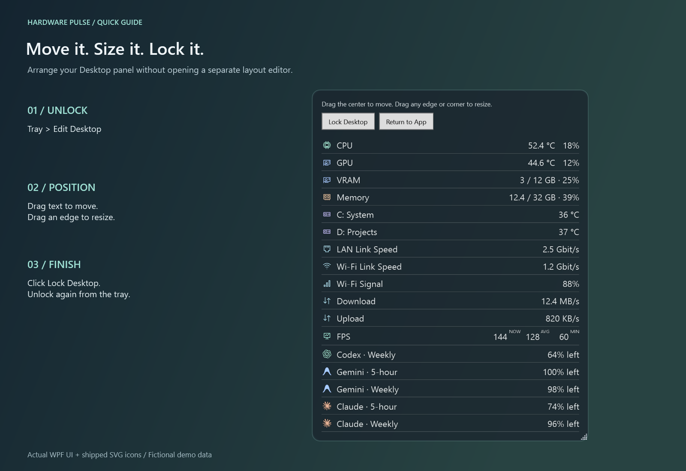
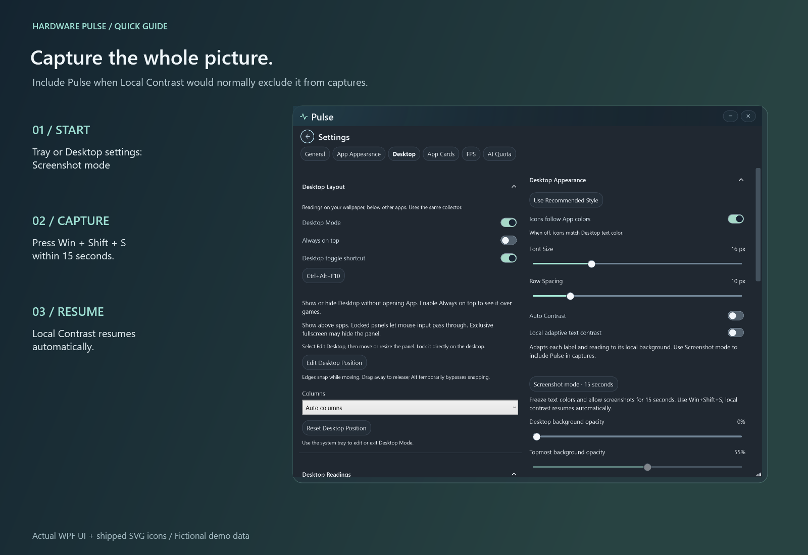
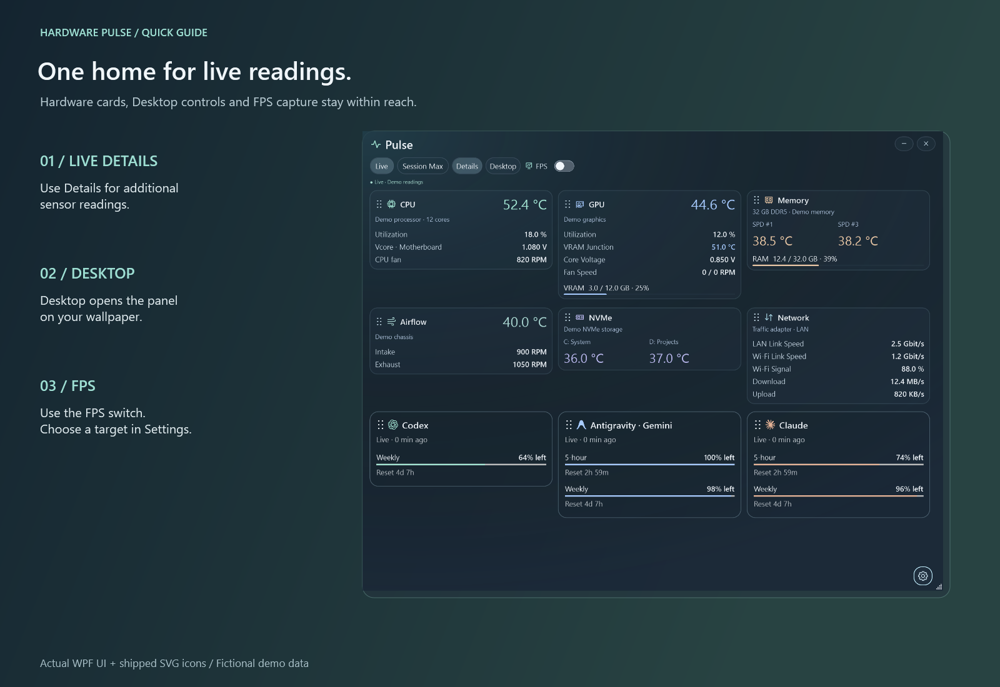

# Pulse 操作示意图

[English](QUICKSTART.md)

图片使用真实 WPF 界面、随软件提供的 SVG 图标和虚构演示数据，不包含个人读数或账户信息。[渲染源代码](../scripts/Render-Hero.ps1)。

## 桌面：移动、调整大小与锁定

在系统托盘选择 **编辑桌面**，拖动文字移动面板，拖动边缘或角落调整大小。完成后点击 **锁定桌面**；再次编辑时从托盘解锁。

## 截图模式
局部对比度开启后如截图看不到 Pulse，可先开启 **截图模式**，15 秒内按 **Win + Shift + S**；随后自动恢复。

## 应用操作与 FPS
**明细** 显示更多读数。桌面内的 FPS 读数可独立开启，无需开启单独的 FPS 悬浮层。`NOW / AVG / MIN` 分别为当前、滚动平均和滚动最低 FPS。

